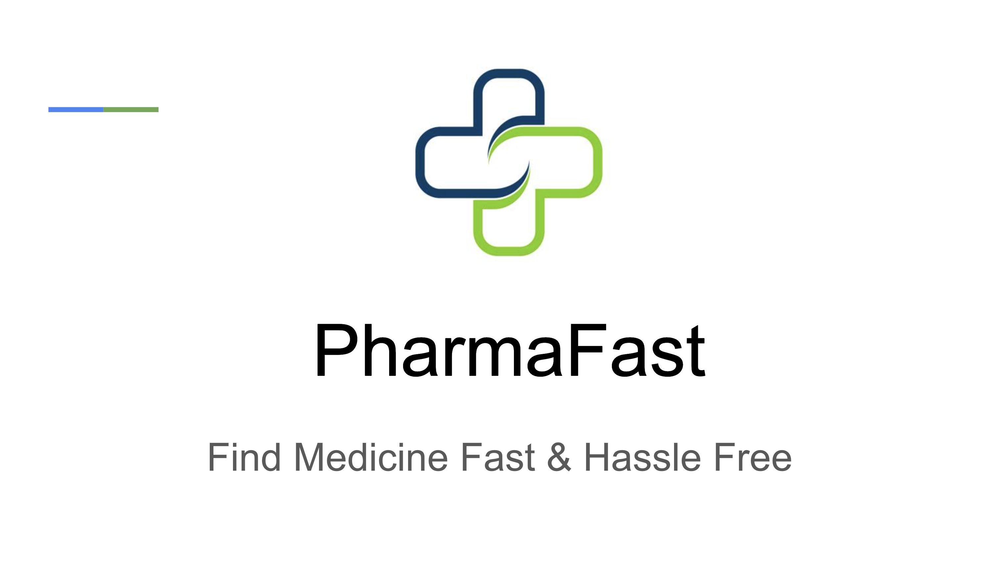
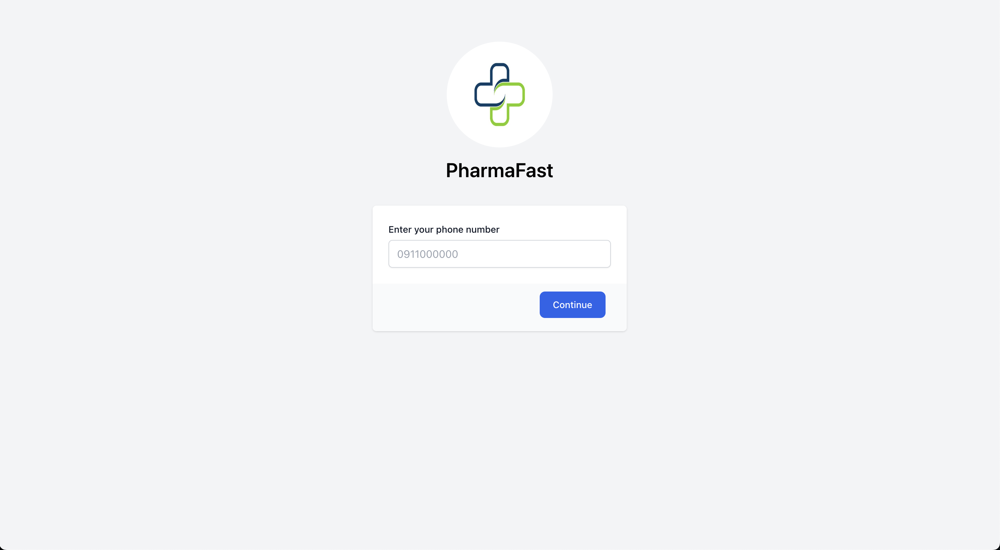
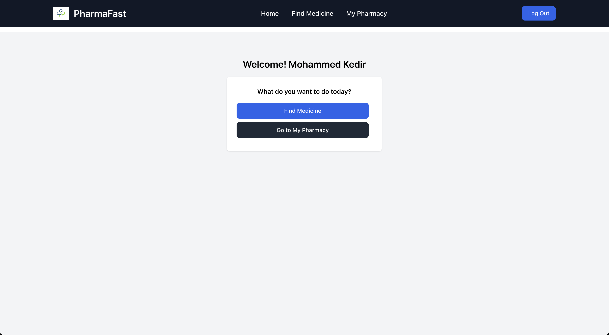
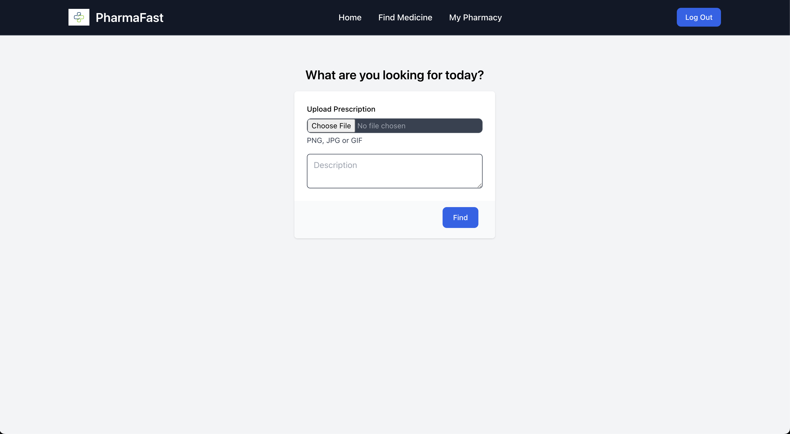
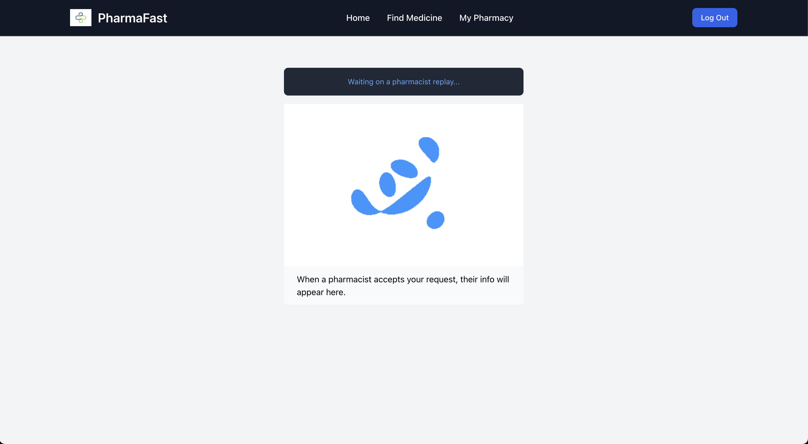
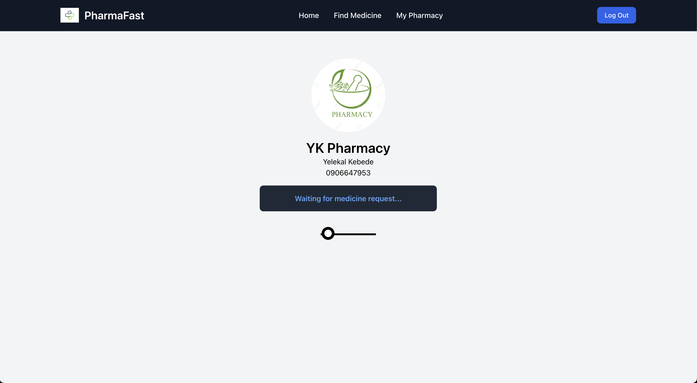
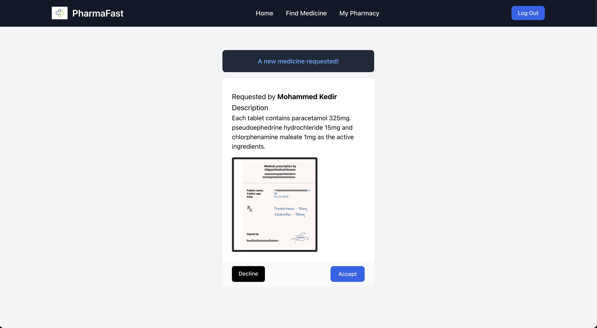
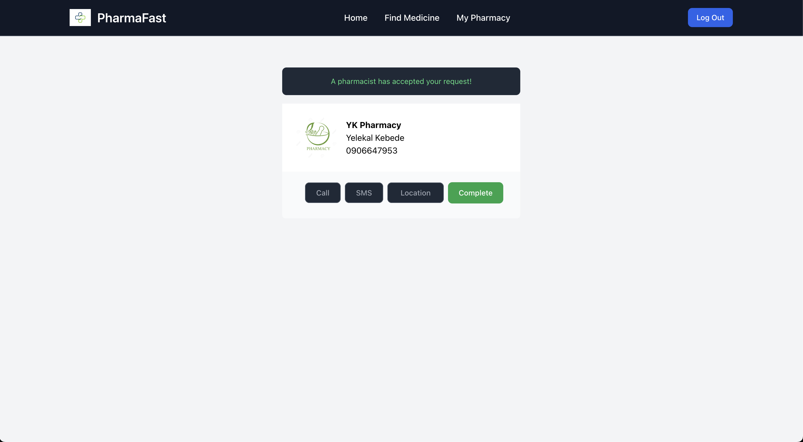

### PharmaFast
Find Medicine Fast & Hassle Free

## Requirements

Starting the project

#### To run backend

    Go to the backend directory and read the README.md file

#### To run frontend

    Go to the frontend directory and read the README.md file

## Author
[Mohammed Kedir](https://linkedin.com/in/mkdrmash)
- Email: [mkdrmash@gmail.com](mailto:mkdrmash@gmail.com)
- Linkedin: [@mkdrmash](https://linkedin.com/in/mkdrmash)
- Github: [@mkdrmash](https://github.com/mkdrmash)

---
## Video Demo
#### YouTube

---
## Screenshots
##### Login Page

##### Home Page

##### Find Medicine Page

##### Waiting for Pharmacist Replay Page

##### Waiting for Medicine Request Page

##### Medicine Request Page

##### Pharmacist Accepted your request Page

